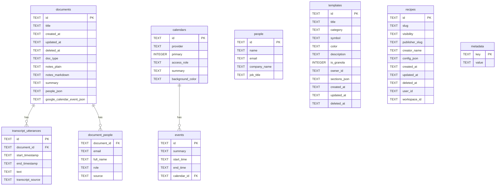
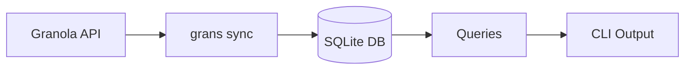

# Database Schema

grans uses SQLite as its sole runtime data layer. Data is fetched from the Granola API via `grans sync` and stored locally in SQLite for fast querying.

## Schema Version

Current schema version: **3**

The schema version is stored in the `metadata` table and checked on startup. If it differs from the expected version, the database is rebuilt.

## Entity Relationship Diagram



## Tables

### documents

The core table storing meeting documents from Granola.

| Column | Type | Description |
|--------|------|-------------|
| `id` | TEXT | Primary key, Granola document ID |
| `title` | TEXT | Meeting title |
| `created_at` | TEXT | ISO 8601 timestamp |
| `updated_at` | TEXT | ISO 8601 timestamp |
| `deleted_at` | TEXT | ISO 8601 timestamp (soft delete) |
| `doc_type` | TEXT | Document type classification |
| `notes_plain` | TEXT | Plain text notes |
| `notes_markdown` | TEXT | Markdown formatted notes |
| `summary` | TEXT | AI-generated meeting summary |
| `people_json` | TEXT | JSON array of attendee data |
| `google_calendar_event_json` | TEXT | JSON blob of linked calendar event |

### transcript_utterances

Individual speech segments from meeting transcripts.

| Column | Type | Description |
|--------|------|-------------|
| `id` | TEXT | Primary key |
| `document_id` | TEXT | Foreign key to `documents.id` |
| `start_timestamp` | TEXT | Start time of utterance |
| `end_timestamp` | TEXT | End time of utterance |
| `text` | TEXT | Transcribed speech text |
| `transcript_source` | TEXT | Source of transcript (`cache` or `api`) |

### document_people

Junction table linking documents to people with their roles.

| Column | Type | Description |
|--------|------|-------------|
| `document_id` | TEXT | Foreign key to `documents.id` |
| `email` | TEXT | Person's email address |
| `full_name` | TEXT | Person's display name |
| `role` | TEXT | Role in meeting (`creator`, `attendee`) |
| `source` | TEXT | Data source (`document`, `calendar`) |

### people

Contact/person records from Granola.

| Column | Type | Description |
|--------|------|-------------|
| `id` | TEXT | Primary key |
| `name` | TEXT | Display name |
| `email` | TEXT | Email address |
| `company_name` | TEXT | Company/organization |
| `job_title` | TEXT | Job title |

### calendars

Connected calendar accounts.

| Column | Type | Description |
|--------|------|-------------|
| `id` | TEXT | Primary key |
| `provider` | TEXT | Calendar provider (e.g., `google`) |
| `primary` | INTEGER | Boolean flag for primary calendar |
| `access_role` | TEXT | Access level |
| `summary` | TEXT | Calendar name/description |
| `background_color` | TEXT | Display color |

### events

Calendar events linked to calendars.

| Column | Type | Description |
|--------|------|-------------|
| `id` | TEXT | Primary key |
| `summary` | TEXT | Event title |
| `start_time` | TEXT | ISO 8601 start timestamp |
| `end_time` | TEXT | ISO 8601 end timestamp |
| `calendar_id` | TEXT | Foreign key to `calendars.id` |

### templates

Meeting note templates.

| Column | Type | Description |
|--------|------|-------------|
| `id` | TEXT | Primary key |
| `title` | TEXT | Template name |
| `category` | TEXT | Template category |
| `symbol` | TEXT | Icon/emoji symbol |
| `color` | TEXT | Display color |
| `description` | TEXT | Template description |
| `is_granola` | INTEGER | Boolean flag for built-in templates |
| `owner_id` | TEXT | Owner user ID |
| `sections_json` | TEXT | JSON array of template sections |
| `created_at` | TEXT | ISO 8601 timestamp |
| `updated_at` | TEXT | ISO 8601 timestamp |
| `deleted_at` | TEXT | ISO 8601 timestamp (soft delete) |

### recipes

Automation recipes/integrations.

| Column | Type | Description |
|--------|------|-------------|
| `id` | TEXT | Primary key |
| `slug` | TEXT | URL-friendly identifier |
| `visibility` | TEXT | Visibility setting |
| `publisher_slug` | TEXT | Publisher identifier |
| `creator_name` | TEXT | Creator display name |
| `config_json` | TEXT | JSON configuration |
| `created_at` | TEXT | ISO 8601 timestamp |
| `updated_at` | TEXT | ISO 8601 timestamp |
| `deleted_at` | TEXT | ISO 8601 timestamp (soft delete) |
| `user_id` | TEXT | Owner user ID |
| `workspace_id` | TEXT | Workspace ID |

### metadata

Key-value store for database metadata.

| Column | Type | Description |
|--------|------|-------------|
| `key` | TEXT | Primary key |
| `value` | TEXT | Stored value |

Currently stores:
- `schema_version`: Current schema version number
- `last_sync_<entity>`: ISO 8601 timestamps of last sync for each entity type (e.g., `last_sync_documents`, `last_sync_people`)

## Full-Text Search (FTS5) Virtual Tables

### transcript_fts

Full-text search index for transcript content.

```sql
CREATE VIRTUAL TABLE transcript_fts USING fts5(
    text,
    content='transcript_utterances',
    content_rowid='rowid'
);
```

Enables fast text search across all transcript utterances. This is a contentless FTS table that references `transcript_utterances`.

### notes_fts

Full-text search index for meeting notes.

```sql
CREATE VIRTUAL TABLE notes_fts USING fts5(
    notes_plain,
    notes_markdown,
    content='documents',
    content_rowid='rowid'
);
```

Enables fast text search across meeting notes (both plain and markdown formats). This is a contentless FTS table that references `documents`.

## Data Flow



The `grans sync` command:
1. Authenticates using the token from Granola's `supabase.json` config
2. Fetches data from Granola API endpoints (`get-documents`, `get-people`, etc.)
3. Upserts records into the local SQLite database
4. Tracks last sync time per entity type in the `metadata` table
